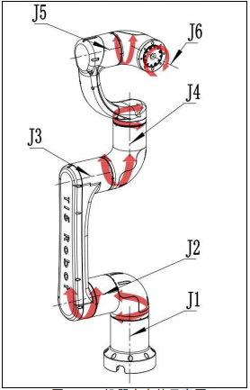
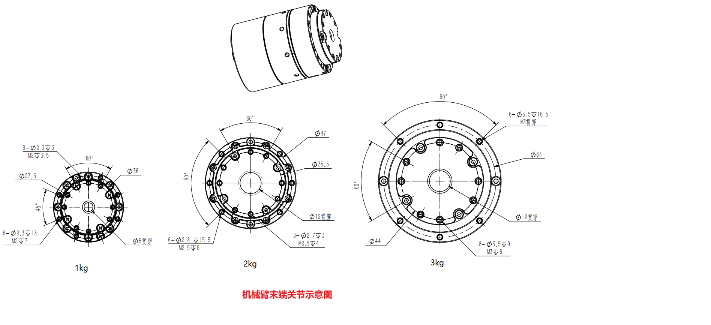

# 规格参数

|型号|Ti5 Robot Arm-1| |Ti5 Robot Arm-1|
|:-:|:-:|
|自由度|6轴|
|自重|2.3kg|
|负载|1kg|
|工作半径|380mm|
|重复定位精度|0.05mm|
|电源需求|DC 48V，5A；DC 24V，5A|
|接口|Can|
|用户控制系统|Ubuntu|
|典型功耗|50W|

## 机械臂运动范围

## 旋转方向及坐标系

### 关节坐标系

 

z1机械臂关节序号及关节转动正方向定义

 

各关节序号从J1开始，逐个递增至J6。在上图中`+`键表示关节转动的正方向，`-`键表示关节转动的负方向。

|关节|各关节旋转法向|关节坐标|
|:-:|:-:|:-:|
|J1|[0, 0, 1]|[0, 0, 0.065]|
|J2|[0, 1, 0]|[0, 0, 0.1115]|
|J3|[0, 1, 0]|[-0.35, 0. 0.1115]|
|J4|[0, 1, 0]|[-0.132, 0, 0.1685]|
|J5|[0, 0, 1]|[-0.06, 0, 0.1685]|
|J6|[1, 0, 0]|[-0.0128, 0, 0.1685]|

实际计算采用弧度制。

### 笛卡尔坐标系

 

笛卡尔空间控制

 

## 末端关节

 

 

其中手爪装载平面（即J6末端平面）的绝对初始位置为[0, 1.5708, 0]，即无手爪时的笛卡尔系末端计算位姿。
